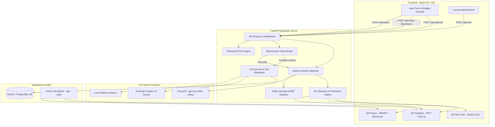

# KOHLER AI Bathroom Designer & Planner

> Intelligent multi-constraint bathroom design, spatial clearance validation, real-time 3D/2D visualization, conversational fixture refinement, and cross-platform Augmented Reality powered by authentic Kohler India catalog data.


# 🚨 LIVE PRODUCTION DEMO — PLEASE READ FIRST

### 🌐 Production Website

**[OPEN KOHLER AI BATHROOM DESIGNER](https://kohler-ai-bathroom-designer-planner-e1r8xz0z9.vercel.app/)**

> ⚠️ **IMPORTANT — PLEASE WAIT 1–2 MINUTES BEFORE USING THE WEBSITE**
>
> The **backend is deployed on Render**, and the free-tier service may go to sleep after a period of inactivity. When this happens, the backend needs some time to start again.
>
> **If the website does not load properly, the AI does not respond, or any feature appears unavailable:**
>
> **1. Wait at least 1–2 minutes.**
> **2. Reload / refresh the website.**
> **3. The application should then work normally.**
>
> **Please do not close the website immediately if it appears to be loading — give the Render backend time to wake up.**

---

# KOHLER AI Bathroom Designer & Planner

---

## Overview

Designing a residential bathroom requires balancing tight spatial clearances, strict plumbing and electrical (MEP) rough-in requirements, budget limits, aesthetic coherence, and sustainability standards. Traditional planning tools either present static product catalogs without spatial intelligence or require complex CAD software with no real-world pricing or catalog integration.

The **KOHLER AI Bathroom Designer & Planner** solves this by combining algorithmic multi-constraint optimization with conversational AI, real-time 3D rendering, and real Kohler product specifications. Users input room dimensions, budget, and design preferences—or upload a rough floor plan sketch—and the system generates three synchronized, clearance-compliant bathroom suite tiers (*Budget-Optimized*, *Balanced Signature*, and *Artisan Luxury*). Users can explore the design in interactive 3D, inspect 2D architectural CAD plans, converse with an AI designer to swap fixtures in real time, view fixtures or full suites in real-scale Augmented Reality (WebXR for Android and Apple AR Quick Look for iOS), and export itemized, branded PDF quotations with water-conservation metrics.

---

## Key Features

- **Multi-Constraint Optimization Engine:** Generates three complete suite tiers simultaneously, evaluating catalog items against budget limits, room area, water pressure tiers, electrical rough-ins, and aesthetic style matching.
- **Spatial Clearance & MEP Validation:** Validates minimum activity envelopes (24″ toilet front, 16.5″ toilet side, 30″ washbasin activity zone, door swing arcs, and bathtub area thresholds ≥ 45 sq ft).
- **Interactive 3D Realistic Room Visualizer:** Renders an architectural room shell using React Three Fiber and Three.js with authentic Kohler `.glb` models, physically based rendering (PBR) materials, dynamic lighting, soft shadows, and multiple camera presets (*3D Orbit*, *Top Plan*, *Eye Level*).
- **2D Architectural Floor Plan Viewer:** Scaled SVG CAD layout displaying exact wall dimensions, baseboard perimeters, fixture bounding boxes, clearance envelopes, and live MEP compliance indicators.
- **Conversational AI Designer Agent:** Chat assistant supporting tool calling (`reoptimize`, `swap_item`, `get_bundle_details`) backed by an 11-category deterministic intent router for sub-millisecond responses on budget math, theme switching, and fixture modifications.
- **Sketch & Photo Layout Analysis (Vision AI):** Accepts hand-drawn sketches or floor plan photos to estimate room dimensions and extract normalized fixture coordinates (`nx`, `nz`) and wall orientations with human-in-the-loop confirmation.
- **Persistent Sketch & Design History:** SQLite/PostgreSQL-backed design history storing original sketch images, extracted proposals, and linked bundle recommendations by session.
- **Cross-Platform Augmented Reality (AR):** Dual-track AR engine supporting Android WebXR (`immersive-ar` with ARCore hit-testing and full-suite assembly) and iOS Safari (Apple AR Quick Look with real-scale `.usdz` assets).
- **Sustainability & Water Conservation Analytics:** Computes annual water savings (liters and gallons), municipal utility cost reductions, and CO₂ pumping footprint reductions against EPA WaterSense, LEED v4, and GRIHA benchmarks.
- **Official PDF Quotation Generator:** Server-side ReportLab document generator producing clean, itemized quotes with pricing, GST breakdowns, MEP compliance certificates, and sustainability summaries.
- **Verified Product Catalog:** Backed by real Kohler India catalog data containing product SKUs, selling prices (INR), MRP, finish variants, flow rates, dimensions, and official store URLs.

---

## Design Themes

The system curates fixture finishes, materials, and form factors across three primary design aesthetics:

| Design Theme | Primary Finishes & Materials | Design Language & Form Factor |
| :--- | :--- | :--- |
| **Minimalist Modern** | Vitreous White, Matte Black, Polished Chrome | Clean geometric lines, floating consoles, wall-hung toilets, rectilinear vessel basins |
| **Classic Luxury** | Brushed Moderne Brass, Vibrant Rose Gold, Polished Chrome | Sculpted vitreous china, ornate handles, statement freestanding tubs, beveled details |
| **Japanese Zen** | Pure White Vitreous China, Cashmere, Brushed Nickel, Natural Wood | Organic fluid curves, compact ergonomics, integrated Veil smart bidet toilets, minimalist rainheads |

---

## How It Works

```
┌─────────────────┐     ┌───────────────────────┐     ┌────────────────────────┐
│   User Inputs   │     │  AI / Vision Parser   │     │ Multi-Constraint Engine │
│ Dimensions,     │ ──> │ Extracts dimensions & │ ──> │ Evaluates clearances,  │
│ Budget, Theme,  │     │ fixture zones from    │     │ budget ceilings, MEP,  │
│ Sketch/Photo    │     │ image / form inputs   │     │ and style affinities   │
└─────────────────┘     └───────────────────────┘     └───────────┬────────────┘
                                                                  │
┌─────────────────────────────────────────────────────────────────┴────────────┐
│                       3 Synchronized Suite Recommendations                   │
│         [ Budget-Optimized ]   •   [ Balanced Signature ]   •   [ Artisan Luxury ] │
└─────────────────────────────────┬────────────────────────────────────────────┘
                                  │
                                  ▼
┌──────────────────────────────────────────────────────────────────────────────┐
│                            Interactive Exploration                           │
│  • 3D Realistic Room (Three.js/R3F)     • Conversational Agent (Tool Calling)│
│  • 2D Architectural CAD Plan (SVG)     • Cross-Platform AR (WebXR / QuickLook)│
│  • Sustainability / MEP Reports        • Official Itemized PDF Quote Export  │
└──────────────────────────────────────────────────────────────────────────────┘
```

1. **Parameter & Layout Ingestion:** The user specifies room length and width (or uploads a hand-drawn sketch for AI dimension estimation), budget in INR, aesthetic theme, water pressure, electrical rough-in status, and bathtub preference.
2. **Constraint & Clearance Analysis:** The backend optimization engine filters the verified Kohler catalog against structural thresholds (e.g., minimum 45 sq ft floor area for bathtubs, water pressure compatibility, 230V electrical supply for smart toilets).
3. **Multi-Tier Bundle Synthesis:** The system selects cohesive fixtures (washbasin, faucet, toilet, shower, mirror/cabinet, optional bathtub) and generates three distinct tiers optimized for budget efficiency, balanced design, and luxury smart technology.
4. **Procedural 3D & 2D Placement:** Automated layout algorithms compute collision-free `[x, y, z]` coordinates and wall alignments (1 unit = 1 foot), calculating clearance buffers for all fixtures.
5. **Conversational Refinement:** The user can interact with the conversational assistant to adjust parameters, swap individual fixtures, or change themes in real time.
6. **Immersive AR & Quote Delivery:** The final assembled suite can be projected into physical space via Augmented Reality and downloaded as an official itemized PDF quotation.

---

## Tech Stack

### Frontend
- **Core Framework:** React 19 (`react`, `react-dom`)
- **Build Tooling:** Vite 8 (`@vitejs/plugin-react`)
- **3D Graphics & Rendering:** Three.js (`three`), React Three Fiber (`@react-three/fiber`), Drei (`@react-three/drei`), Postprocessing (`@react-three/postprocessing`)
- **Augmented Reality:** WebXR Device API (`immersive-ar` with ARCore surface hit-testing and DOM Overlay) and Apple AR Quick Look (`.usdz`)
- **UI & Icons:** Lucide React (`lucide-react`), Vanilla CSS Design System with CSS variables and responsive breakpoints
- **Markdown Rendering:** `react-markdown`
- **Linting:** Oxlint (`oxlint`)

### Backend
- **Framework:** FastAPI (Python 3.10+)
- **ASGI Server:** Uvicorn
- **Data Validation & Settings:** Pydantic v2, `python-dotenv`
- **Database & ORM:** SQLAlchemy 2.0 (SQLite for local development, PostgreSQL-ready)
- **Document Generation:** ReportLab (vector-based PDF quotation generator)
- **HTTP Client:** HTTPX

### AI & Machine Learning
- **Hosted Cloud LLM:** Groq API (`openai/gpt-oss-120b` or Llama models via OpenAI-compatible SDK)
- **Vision & Multimodal:** Anthropic Claude API (`claude-3-5-sonnet-20241022`)
- **Local / Offline LLM Fallback:** Ollama (`llama3.2`, `llama3.2-vision`, `llava`) via `ollama` Python SDK
- **Intent Routing:** Deterministic pattern-matching engine for sub-millisecond intent handling

### Database
- **Local Engine:** SQLite (`kohler.db`)
- **Production Engine:** PostgreSQL with optional `pgvector` extension support

---

## System Architecture



---

## Project Structure

```
kohler-track1/
├── backend/
│   ├── main.py                    # FastAPI application entrypoint, CORS, lifespan, and route registry
│   ├── config.py                  # Pydantic environment configuration, API keys, and LLM mode detection
│   ├── requirements.txt           # Python dependencies (FastAPI, SQLAlchemy, ReportLab, Anthropic, etc.)
│   ├── db/
│   │   ├── models.py              # SQLAlchemy models: Product and SketchHistory
│   │   ├── session.py             # Database engine, session maker, and table initialization
│   │   ├── schema.sql             # SQL DDL for PostgreSQL and SQLite schemas
│   │   └── load_catalog.py        # Seed script importing kohler_catalog.json into database
│   ├── routers/
│   │   ├── catalog.py             # Catalog browse, filter, and SKU detail endpoints
│   │   ├── optimize.py            # Multi-constraint bundle generation endpoint
│   │   ├── chat.py                # Conversational agent chat endpoint
│   │   ├── export.py              # PDF quotation download endpoint
│   │   ├── vision.py              # Sketch/photo dimension and zone extraction endpoint
│   │   └── history.py             # Sketch upload and design history CRUD endpoints
│   └── services/
│       ├── optimizer.py           # Multi-constraint bundle selection and budget distribution
│       ├── placement.py           # Procedural 3D/2D coordinate placement and clearance checks
│       ├── sustainability.py      # Water savings, cost reduction, and CO2 calculation engine
│       ├── pdf_export.py          # ReportLab PDF generator with custom vector icons
│       └── llm.py                 # LLM service, tool definitions, session store, and intent router
├── frontend/
│   ├── index.html                 # HTML entry point with viewport configuration
│   ├── package.json               # Frontend dependencies (React, Vite, Three.js, R3F, Lucide)
│   ├── vite.config.js             # Vite configuration with 0.0.0.0 host binding
│   ├── public/
│   │   └── models/                # Verified Kohler GLTF/GLB models and Apple USDZ assets
│   └── src/
│       ├── main.jsx               # React DOM mounting
│       ├── App.jsx                # Root application layout, state orchestration, and API wiring
│       ├── App.css                # Layout and modal utility styling
│       ├── index.css              # Kohler Monochrome design tokens, typography, and base styles
│       ├── components/
│       │   ├── Room3DViewer.jsx   # Three.js / React Three Fiber interactive 3D scene
│       │   ├── Room2DViewer.jsx   # Scaled 2D SVG architectural floor plan with clearance overlays
│       │   ├── InputForm.jsx      # Dimension, budget, theme, MEP controls, and sketch upload
│       │   ├── BundleComparison.jsx # 3-tier side-by-side bundle comparison component
│       │   ├── ChatPanel.jsx      # Floating conversational AI chat drawer
│       │   ├── FixtureDetailModal.jsx # Full-screen product spec and MEP engineering modal
│       │   └── ARSelectionModal.jsx   # Modal for launching full suite or single fixture in AR
│       └── utils/
│           └── arSession.js       # Complete WebXR AR engine for Android (hit-testing, suite layout)
├── kohler.db                      # Local SQLite catalog and sketch history database
├── kohler_catalog.json            # Master catalog dataset of verified Kohler India products
├── kohler-bathroom-designer-PRD.md # Product Requirements Document
├── IMPLEMENTATION.md              # Technical implementation verification report
└── README.md                      # Project documentation
```

---

## Installation & Setup

### Prerequisites

Ensure the following tools are installed on your system:
- **Python:** Version 3.10 or higher
- **Node.js:** Version 18.0 or higher (with `npm`)
- **Git:** Latest version
- **LLM Access:** An API key for **Groq** (free tier available at [console.groq.com](https://console.groq.com)), or a local **Ollama** installation(optional, if you dont want groq).

---

### Step 1: Clone the Repository

Open Windows PowerShell and clone the repository:

```powershell
git clone https://github.com/aarchitajha/Track-1-KOHLER-AI-Bathroom-Designer-Planner
cd kohler-ai-bathroom-designer
```

---

### Step 2: Backend Setup

1. **Create and activate a Python virtual environment:**

   ```powershell
   python -m venv .venv
   .\.venv\Scripts\Activate.ps1
   ```

2. **Install Python dependencies:**

   ```powershell
   pip install -r backend\requirements.txt
   ```

3. **Configure environment variables:**

   Create or edit `backend/.env`:

   ```env
   DATABASE_URL=sqlite:///./kohler.db
   GROQ_API_KEY=gsk_YOUR_GROQ_API_KEY_HERE
   GROQ_MODEL=openai/gpt-oss-120b
   ```
   #### Optional: Ollama Local LLM Setup

If you prefer to run the AI models locally instead of using a cloud-based Groq API, you can use **Ollama**.

> **Note:** Ollama is optional. You do **not** need to install Ollama if you are using Groq.

**1. Install Ollama**

Download and install Ollama from the official website:

https://ollama.com/

**2. Verify the installation**

Open a new PowerShell window and run:

```powershell
ollama --version
```

**3. Download the required model**

For the local conversational AI:

```powershell
ollama pull llama3.2
```

Verify that the model has been downloaded:

```powershell
ollama list
```

**4. Configure Ollama in `backend/.env`**

If you are using Ollama instead of Groq, configure:

```env
DATABASE_URL=sqlite:///./kohler.db
OLLAMA_BASE_URL=http://localhost:11434
OLLAMA_MODEL=llama3.2
OLLAMA_KEEP_ALIVE=60m
```

**5. Verify Ollama is running**

Run:

```powershell
ollama run llama3.2
```

If the model starts successfully, Ollama is ready to use.

Then start the backend normally:

```powershell
uvicorn backend.main:app --host 0.0.0.0 --port 8004 --reload
```

### Optional Vision Models

For local sketch/photo analysis, the application can also use Ollama vision models when supported by the backend configuration.

Available models include:

```powershell
ollama pull llama3.2-vision
```

or:

```powershell
ollama pull llava
```

You can verify installed models with:

```powershell
ollama list
```

> **For the easiest setup, use Groq for the deployed/cloud application and Ollama when running the project locally.**


4. **Seed the database:**

   Populate the SQLite database with verified Kohler catalog products:

   ```powershell
   python -m backend.db.load_catalog
   ```

5. **Start the FastAPI backend server:**

   ```powershell
   uvicorn backend.main:app --host 0.0.0.0 --port 8004 --reload
   ```

   - API Documentation: [http://localhost:8004/docs](http://localhost:8004/docs)
   - Health Check: [http://localhost:8004/health](http://localhost:8004/health)

---

### Step 3: Frontend Setup

Open a **separate** Windows PowerShell window:

1. **Navigate to the frontend directory:**

   ```powershell
   cd d:\kohler-track1\frontend
   ```

2. **Install Node.js dependencies:**

   ```powershell
   npm install
   ```

3. **Start the Vite development server:**

   ```powershell
   npm run dev
   ```

   - Web Application: [http://localhost:5173](http://localhost:5173)

---

## Environment Variables

Configure backend settings in `backend/.env`. Existing operating system environment variables take precedence.

| Variable Name | Description | Default / Example | Required |
| :--- | :--- | :--- | :--- |
| `DATABASE_URL` | SQLAlchemy connection string for catalog and sketch storage | `sqlite:///./kohler.db` | No |
| `GROQ_API_KEY` | API key for hosted Groq LLM inference | `gsk_YOUR_KEY_HERE` | Yes (if not using Anthropic/Ollama) |
| `GROQ_MODEL` | Model identifier on Groq | `openai/gpt-oss-120b` | No |
| `ANTHROPIC_API_KEY` | Anthropic Claude API key for multimodal vision and chat | `sk-ant-YOUR_KEY_HERE` | Optional |
| `OLLAMA_BASE_URL` | Base URL for local Ollama instance | `http://localhost:11434` | Optional |
| `OLLAMA_MODEL` | Local Ollama model identifier for chat | `llama3.2` | Optional |
| `OLLAMA_KEEP_ALIVE` | Memory residency duration for warmed-up Ollama models | `60m` | Optional |
| `VITE_API_BASE_URL` | Frontend API base URL (configured in `frontend/.env`) | `http://localhost:8004` | No |

---

## Usage Guide

1. **Set Room Dimensions & Budget:**
   - Use the sliders in the left panel to define room length (6–24 ft) and width (5–20 ft).
   - Set your total renovation budget (₹30,000 to ₹6,00,000+).
   - Select your preferred aesthetic theme (*Minimalist Modern*, *Classic Luxury*, or *Japanese Zen*).
   - Toggle MEP constraints (water pressure tier, 230V electrical rough-in, bathtub preference, and green building standard).

2. **Upload a Hand-Drawn Sketch (Optional):**
   - Click the **Upload Floor Plan / Sketch** dropzone in the configuration panel.
   - The Vision AI pipeline analyzes the layout, proposes estimated dimensions, and extracts fixture zones.
   - Review and confirm the proposed layout to automatically populate the 3D room.

3. **Explore 3D and 2D Views:**
   - Use the view toggle to switch between **3D Orbit View** and **2D Architectural CAD Plan**.
   - In 3D: Left-click and drag to orbit, right-click to pan, and scroll to zoom. Use the camera preset buttons (*3D Orbit*, *Top Plan*, *Eye Level*) to reorient the view.
   - Click any fixture in the 3D or 2D view to open the **Fixture Details Modal** displaying technical specs, flow rates, electrical requirements, and live pricing.

4. **Compare Suite Tiers:**
   - Review the three generated suite cards (*Budget-Optimized*, *Balanced Signature*, and *Artisan Luxury*).
   - Click a card to instantly switch the active suite and update the 3D visualizer.

5. **Chat with the AI Designer:**
   - Click the floating chat icon in the bottom-right corner.
   - Request changes naturally (e.g., *"Switch the theme to Japanese Zen"*, *"Swap the faucet for a matte black model"*, *"Can we add a bathtub under 2.5 lakhs?"*).
   - The conversational agent executes the appropriate tools and live-updates the 3D room.

6. **View in Augmented Reality (AR):**
   - On an Android phone with ARCore (over HTTPS or LAN): Tap **View in AR**, then select **Launch Full Suite in AR** to place the entire room layout on your floor, or select an individual fixture for spot placement.
   - On an iPhone/iPad: Tap **View in AR** to launch native Apple AR Quick Look with real-scale USDZ models.

7. **Export Itemized PDF Quotation:**
   - Click **Download PDF Quote** in the header.
   - The server generates an official, itemized PDF containing fixture SKUs, prices, GST calculations, MEP compliance declarations, and annual water savings data.

---

## AI & Multi-Constraint System

The application's intelligence is split across four dedicated subsystems:

### 1. Multi-Constraint Optimization Engine (`optimizer.py`)
- **Spatial Bin-Packing:** Partitions room area into functional activity zones (basin/vanity, toilet, shower/wet area, bathtub). Enforces mandatory clearances (minimum 24″ in front of toilets, 30″ in front of basins, 16.5″ side clearance).
- **Aesthetic Style Scoring:** Computes style affinity scores between product tags/finishes and target themes (`Minimalist Modern`, `Classic Luxury`, `Japanese Zen`).
- **MEP Engineering Validation:** Enforces water pressure thresholds (e.g., diverters requiring ≥ 3.0 Bar are excluded if pressure is set to low) and electrical availability (bidet seats and smart mirrors requiring 230V rough-ins).
- **Budget Allocation:** Dynamically distributes budget ceilings across categories (e.g., 30% washbasin/vanity, 25% toilet, 25% shower, 12% faucet, 8% mirror).

### 2. Conversational Designer & Tool Calling (`llm.py`)
- **Native Function Calling:** The LLM uses structured tool definitions:
  - `reoptimize(budget_inr, theme, length_ft, width_ft, include_bathtub, water_pressure, ...)`
  - `swap_item(category, sku, target_finish, max_price_inr)`
  - `get_bundle_details(bundle_id)`
- **Deterministic Intent Router:** A regex-based intent classification engine intercepts common commands (budget math, theme switches, greetings, dimensions) and executes them deterministically in < 1ms, bypassing external LLM latency while maintaining natural conversational capabilities.

### 3. Vision Layout Analysis (`vision.py`)
- **Three-Tier Fallback Chain:**
  1. Anthropic Claude 3.5 Sonnet Vision (`claude-3-5-sonnet-20241022`)
  2. Local Ollama Vision Models (`llama3.2-vision`, `llava`, `minicpm-v`)
  3. Aspect-ratio heuristic algorithm with MD5-seeded dimension estimation
- **Spatial Zone Normalization:** Maps detected fixtures to normalized room coordinates `[nx, nz]` clamped within structural wall margins.

### 4. Sustainability Calculator (`sustainability.py`)
- Calculates annual consumption against standard baseline fixtures (Toilet: 6.0 LPF, Shower: 15.0 LPM, Faucet: 8.3 LPM) using standard household usage profiles (7,300 flushes/year, 8,760 shower-minutes/year, 5,475 faucet-minutes/year).
- Verifies compliance against **LEED v4**, **GRIHA 4-Star**, and **EPA WaterSense** standards.

---

## AI/LLM Provider Hierarchy

The backend implements an automatic provider resolution and fallback hierarchy:

```
┌────────────────────────────────────────────────────────┐
│               Provider Detection Flow                  │
│                                                        │
│  1. Check for ANTHROPIC_API_KEY                        │
│     └── If valid 'sk-ant-*' -> Use Anthropic Claude    │
│                                                        │
│  2. Check for GROQ_API_KEY                             │
│     └── If valid 'gsk_*'    -> Use Groq Cloud LLM      │
│                                                        │
│  3. Check OLLAMA_BASE_URL (http://localhost:11434)     │
│     └── If daemon responds  -> Use Local Ollama        │
│                                                        │
│  4. None Configured                                    │
│     └── Fail loudly at startup with descriptive error  │
└────────────────────────────────────────────────────────┘
```

The system requires at least one valid LLM provider at startup and explicitly rejects silent canned-response modes.

---

## API Endpoints

| Method | Endpoint | Description | Request Payload / Params | Response Summary |
| :--- | :--- | :--- | :--- | :--- |
| `GET` | `/health` | Liveness check | None | `{"status": "healthy", "llm_mode": "groq"}` |
| `GET` | `/api/catalog` | Filter catalog products | Query: `category`, `sub_type`, `area`, `finish`, `verified_only` | `{"count": int, "products": [...]}` |
| `GET` | `/api/catalog/{sku}` | Get single product by SKU | Path: `sku` | Product object or 404 error |
| `POST` | `/api/optimize` | Generate 3 suite bundles | JSON: `length_ft`, `width_ft`, `budget_inr`, `theme`, `water_pressure`, `electrical_rough_in`, `include_bathtub`, `green_certification`, `sketch_layout` | `{"bundles": [...], "room_specs": {...}}` |
| `POST` | `/api/chat` | Conversational turn | JSON: `session_id`, `message`, `active_bundle`, `current_params` | `{"reply": str, "tool_called": str, "active_bundle": {...}}` |
| `POST` | `/api/export` | Generate quotation PDF | JSON: `bundle`, `room_specs` | Binary stream (`application/pdf`) |
| `POST` | `/api/vision-dimensions` | Parse sketch image | Multipart Form: `file` (image), `hint` (optional), `session_id` | `{"proposed_dimensions": {...}, "inferred_layout": [...]}` |
| `GET` | `/api/sketch-history` | List session sketches | Query: `session_id` | Array of serialized sketch objects |
| `PUT` | `/api/sketch-history/{id}/bundle` | Save bundle to sketch | Path: `id`, JSON: `bundle` | `{"id": str, "bundle": {...}}` |
| `DELETE`| `/api/sketch-history` | Clear session sketches | Query: `session_id` | `{"deleted_count": int}` |
| `DELETE`| `/api/sketch-history/{id}` | Delete single sketch | Path: `id`, Query: `session_id` | `{"deleted": str}` |

---

## Screenshots / Demo

<!-- Placeholder for Application Screenshots -->
| 3D Realistic Room Visualizer | 2D Architectural CAD Floor Plan |
| :---: | :---: |
| *[Screenshot Placeholder: 3D Room Visualizer with Kohler Modern Suite]* | *[Screenshot Placeholder: 2D SVG Floor Plan with Clearance Envelopes]* |

| Conversational AI Designer Agent | Augmented Reality (AR) Studio |
| :---: | :---: |
| *[Screenshot Placeholder: AI Chat Drawer with Tool Execution]* | *[Screenshot Placeholder: WebXR AR Full Suite Placement]* |

---

## Deployment

### Frontend Deployment (Vercel)
1. Link the `frontend/` directory to a new Vercel project.
2. Build Settings:
   - **Framework Preset:** Vite
   - **Root Directory:** `frontend`
   - **Build Command:** `npm run build`
   - **Output Directory:** `dist`
3. Environment Variables:
   - Set `VITE_API_BASE_URL` to your live backend domain (e.g., `https://api.yourdomain.com`).

### Backend Deployment (Render / Railway / Cloud VPS)
1. Deploy using the provided `backend/requirements.txt` and Python 3.10+ runtime.
2. Start Command:
   ```bash
   uvicorn backend.main:app --host 0.0.0.0 --port $PORT
   ```
3. Set environment variables (`GROQ_API_KEY` or `ANTHROPIC_API_KEY`, `DATABASE_URL`).
4. Ensure HTTPS is enabled on the backend domain to satisfy WebXR and camera security requirements.

---

## Future Enhancements

- **3D Tile & Finish Customizer:** Interactive wall tile texture mapping and dynamic lighting color temperature controls.
- **BIM Revit / IFC Export:** Direct export of 3D bathroom layouts into standard BIM formats for professional architects.
- **Plumbing Rough-In Routing Visualizer:** Procedural 3D visualization of in-wall supply lines, drain pipe slopes, and vent stacks.
- **Multi-Room Project Management:** Ability to save and organize multiple bathrooms within a single residential project.

---

## Authors

- **KOHLER AI Challenge Team** — Track 1: AI Bathroom Designer & Planner

---

## License

This project is developed for the Kohler AI Case Study Competition. All product names, trademarks, and registered trademarks are property of their respective owners. Kohler product specifications, imagery, and 3D models are used for demonstration and educational purposes.
